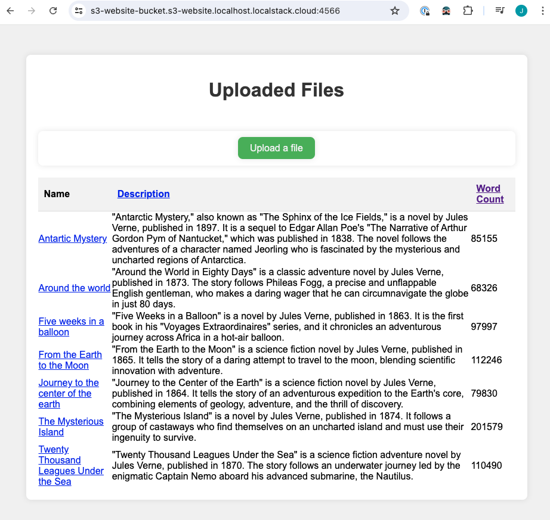

# leases4s


[](https://github.com/jchapuis/leases4s/actions/workflows/release.yml)
[](https://maven-badges.herokuapp.com/maven-central/io.github.jchapuis/leases4s_2.13)
[](https://codecov.io/gh/jchapuis/leases4s)
<a href="https://typelevel.org/cats/"></a>

Tagless abstractions for leases in Kubernetes allowing for use cases such as distributed critical section, leader election, etc. 

## Getting started

Add the following dependency to your `build.sbt`:

```scala
libraryDependencies += "io.github.jchapuis" %% "leases4s-core" % "x.y.z" // latest from maven badge above
```

## Abstractions
As the library name suggests, the library is all about leases and everything revolves around these two main abstractions: 

### Lease
The `Lease` trait is the main abstraction of the library. It represents a lease in Kubernetes, and is parametrized by the effect type `F`. The lease has an identifier, can bear labels for filtering, and has support for metadata in the form of annotations. A lease has a holder and can expire: expiry can be observed via an FS2 stream:

```scala
trait Lease[F[_]] {
  def id: LeaseID
  def holder: F[HolderID]
  def labels: F[List[Label]]
  def annotations: F[List[Annotation]]
  def isExpired: F[Boolean]
  def expired: fs2.Stream[F, Unit]
}
```

### LeaseRepository
Leases are obtained from a `LeaseRepository`, which defines a distributed lease repository, with the ability to acquire leases with automatic renewal, check for other existing leases and watch for related events. A repository is created with a set of labels that act as a filter in Kubernetes to identify the leases it manages. The repository is also configured with parameters for lease acquisition and renewal: leases are automatically renewed before they expire while an active holder node exists.

```scala
trait LeaseRepository[F[_]] {
  def labels: List[Label]
  def acquire(id: LeaseID, holderID: HolderID, annotations: List[Annotation] = Nil)(implicit
      parameters: LeaseParameters = LeaseParameters.Default
  ): Resource[F, HeldLease[F]]
  def get(id: LeaseID): F[Option[Lease[F]]]
  def list: F[List[Lease[F]]]
  def watcher: fs2.Stream[F, LeaseEvent[F]]
}
```

## Patterns
Based on this fundamental abstraction of a distributed lease, one can build a surprising number of higher-level patterns. Patterns are presented below in order of increasing complexity.

### Guard
Holding a distributed lease can be used to protect a critical section of code. The guard pattern is a simple pattern that acquires a lease, runs a critical section of code, and releases the lease when the critical section is done. The lease is automatically renewed while the critical section is running.

This pattern is accessible easily directly when acquiring a lease from the repository: `acquire` returns the `HeldLease` type, which is a `Lease` with the added `guard` method:

```scala
trait HeldLease[F[_]] extends Lease[F] {
  def guard[A](fa: F[A]): F[Outcome[F, Throwable, A]] 
}
```

`guard` runs `fa` guarded by the lease, thus implementing a distributed critical section
    - if the lease is still held after completion of the action, the outcome is `Outcome.Succeeded`
    - if the lease is already expired or expires in the meantime, the action is cancelled and the outcome is `Outcome.Canceled`
    - if the action fails, the outcome is `Outcome.Errored`

The lease is auto-renewed in the background, so in nominal conditions there is no reason for it to expire during the action. However, in case of loss of connectivity to the lease issuer or some other issue preventing renewal of the lease, it may expire before the action completes. In such cases, the action is cancelled and the outcome is `Outcome.Canceled`. 

Note that this pattern does not per-se ensure transactional semantics, as cancellation is best-effort. In other words, if we fail to renew the lease, and it gets revoked while running the action, cancellation or rollback must run before the lease expires. Otherwise, it is possible that another node acquires the lease upon expiry and enters the critical section while we are still trying to exit. If strict transactional semantics are required, the action should use some additional form of strong consistency, like version control or idempotent operations.

## Examples
The bundled example application illustrates a number of these patterns on a real k3d kubernetes instance running locally together with AWS LocalStack for compelling examples. The app is deployed using pulumi and the [besom](https://virtuslab.github.io/besom/) scala plugin.

The example application is a static website of books running from an S3 bucket for fast read access. Book upload is implemented by a scala service running in kubernetes, replicated for high availability and scale. 



### Guard
The books index can be sorted by name, word count and description. This is implemented by three respective static `index.html`, `index-by-word-count.html` and `index-by-description.html` files that are updated by the upload service upon each book upload. These three indices must be kept in sync so that all books are listed in the proper order at all times. Of course, book uploads can happen at any time, potentially triggered by various users simultaneously. To ensure consistency of these updates in the case of such parallel upload operations, the service uses the guard pattern to acquire a distributed lease before updating the indices. 

The interesting bits of the application can be found in `FileUploader.scala`. This class takes an `S3AsyncClient` in parameter and a `LeaseRepository`. The crux of the demonstration happens in the `safeUpdateIndexFiles` method:

```scala
private def safeUpdateIndexFiles(newFile: IndexPage.File) =
    leaseRepository
      .acquire(LeaseID(ks"file-uploader"), HolderID.unique)
      .use(_.guard(updateIndexFiles(newFile)).map(_.embedError))
```

The `updateIndexFiles` method is the critical section that updates the three index files, guarded by the `file-uploader` kubernetes lease while the operation is running.
